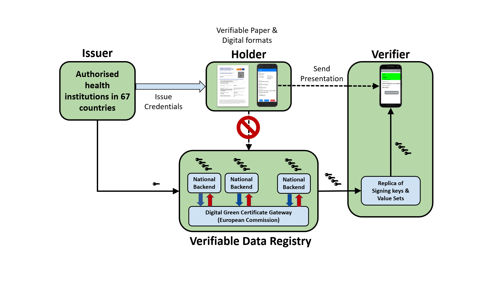

Most Self-Sovereign Identity (SSI) implementations conflate different concepts into one tightly coupled thing. They typically merge together **Identification**, **Verifiable Credentials** and a **Verifiable Data Repository**.

They claim that new identification systems for citizens are required in order to use Verifiable Credentials for solving the problems that citizens have with current identity systems.

In addition, many SSI systems insist on registering the DIDs of the citizens in an immutable public repository (e.g., a blockchain network), claiming that this is needed in order to increase trust and efficiency.

Both claims are completely false, and I will use the EU Digital COVID Certificate (EUDCC) implementation to show why. 

The EUDCC does not use the W3C VC data model and is not based in blockchain, but it can be considered as a type of Verifiable Credential. From the technical and operational point of view, it provides many insights for the incipient world of SSI and W3C Verifiable Credentials. In particular:

- We do not have to wait for the future EU Digital Wallet to start reaping the benefits of Verifiable Credentials. An immense amount of paper and PDF documents can be converted to secure and efficient Verifiable Credentials in all types of industries, solving real problems of the citizens and improving the trust and efficiency of the society.

- DIDs of citizens should NEVER be registered in any public repository, and this applies to any type of personal data including Verifiable Credentials or hashes derived from personal data. Many SSI implementations insist on doing it, most probably due to ignorance of designers or even by laziness of programmers. I have not yet found a realistic use case that requires registering personal data in any public repository.

- As a bonus from not registering any personal data in the public repository, the system is massively parallel and can scale to millions of credentials issued and verified without any impact on performance.

- Inclusivity requires support for paper format without reducing trust or privacy, something I call *Verifiable Paper*. Most SSI implementations do not support paper format, or if they do it is ate the expense of reduced privacy and risk of tracking of citizen's usage of credentials.

In this short document I use the EUDCC implementation as an example to illustrate the points above. In addition, the exercise also shows possible paths to improve the current EUDCC implementation by converting it into a full-fledged Verifiable Credentials ecosystem.

# Introduction

The EU Digital COVID Certificate (EUDCC) started as an EU-only initiative for the issuance of digital and paper cryptographically verifiable credentials. But today (May 2022) the EU DCC system is currently in use in all EU Member States, EEA countries as well as many countries outside the European Union (67 in total). The map below shows the countries currently operating in the system, but more countries may join the infrastructure after the adoption by the Commission of an ‘equivalence decision’. For example, it does not include many latin-american countries which have already decided to use the same technical standards but have not yet achieved the equivalence agreements.

From the point of view of the technical and operational implementation, the system has been an incredible success, even unimaginable taking into account the speed at which it was designed, developed collaboratively and deployed in production.

The EUDCC does not use the W3C Verifiable Credential Data Model, but under the hood its implementation is surprisingly similar to many SSI (Self-Sovereign Identity) ecosystems using Verifiable Credentials. The next figure is a high-level mapping of the EUDCC components into the W3C Verifiable Credential model.

# Natural Persons and Juridical Persons have to be completely segregated

**Implementations for Natural Persons (NP) and Juridical Persons (JP) should be as separate as possible, to minimise risks of handling NP PII as LP business data.**

When the work on W3C Verifiable Credentials [11] and DIDs (Decentralized Identifiers) [10] started, there was a very strong focus on natural persons (versus juridical persons) and in solving some severe problems that citizens have with the current identity systems. Actually, both concepts were somewhat conflated and mixed together.

However, when many initiatives explored the practical application to the real world of Verifiable Credentials, it became clear that those concepts could be used together but were really independent, so two specifications were created. As the current version of the W3C Verifiable Credentials Data Model (v1.1) states (emphasis added):

> As of this publication, DIDs are a new type of identifier that **are not necessary for verifiable credentials to be useful**. Specifically, **verifiable credentials do not depend on DIDs and DIDs do not depend on verifiable credentials**. However, it is expected that many verifiable credentials will use DIDs and that software libraries implementing this specification will probably need to resolve DIDs. DID-based URLs are used for expressing identifiers associated with subjects, issuers, holders, credential status lists, cryptographic keys, and other machine-readable information associated with a verifiable credential.

Based on the feedback from exploration of real use cases, the W3C Verifiable Credentials Working Group evolved the specification to enable wider coverage of many interesting use cases and taking into account compliance to current country/regional regulation and also industry-specific regulation.

However, the DID specification was not evolved in the same way, keeping its legacy of strong focus on natural persons and trying to avoid any type of central entity, including those whose mission is the protection of the citizen.

This lack of real-world feedback can be further appreciated in the fact that both W3C specifications are contradictory. The formal definition of DID [10] states that it is a *globally unique persistent identifier*.

However, the more mature Verifiable Credentials specification says:

> If strong anti-correlation properties are a requirement in a verifiable credentials system, it is strongly advised that identifiers are either:
> - Bound to a single origin
> - Single-use
> - Not used at all, but instead replaced by short-lived, single-use bearer tokens.

It seems that the current DID specification shares the same spirit and ideology of Bitcoin and other cryptocurrencies, so a literal interpretation of the document makes it very difficult to use many DID Methods in the real economy and comply with EU regulations like GDPR or the Consumer Protection directive (for natural persons), or compliance to most legal requirements in the EU (for juridical persons).

This section describes a real-world interpretation of DIDs which is better suited to the EU environment and at the same time provides the same advantages than the original DID in solving the major problems that citizens have with current identity systems.
The focus here is on legal persons, because DIDs for natural persons will probably be handled in the upcoming eIDAS2 regulation and the EU Digital Identity Wallet.

# Requirements on a DID for juridical persons

According to the current DID specification, a DID is a new type of identifier with 4 essential characteristics:

- **decentralized**: there should be no central issuing agency;
- **persistent**: the identifier should be inherently persistent, not requiring the continued operation of an underling organization;
- **cryptographically verifiable**: it should be possible to prove control of the identifier cryptographically;
- **resolvable**: it should be possible to discover metadata about the identifier.

For juridical persons in the EU and many other regions of the world, there is a fundamental problem with the first characteristic. Actually, that characteristic is undesirable in any advanced society that shares the EU values and where the citizen is the most important thing.

The EU regulatory environment requires that identities (and identifiers) of any juridical person be completely public and subject to public scrutiny, whether from regulators, consumer organisations, industry watchdogs or any other interested party. Some examples:

- Any of the 30 million businesses in the EU is required by law to register with the appropriate national or international body before being able to engage in any relevant activity. During the process, an identifier is assigned to the business. The registration process and the way to obtain the identifier varies depending on the industry regulation (e.g., banking, telco, health, ...) and other factors.
- The identities of businesses are public and anybody can access all related information from the relevant registries. Even if in some EU countries access is not free, it is public. Information includes many details about the business, including identifier, ownership and place of establishment.
- Businesses are required to include those identifiers in any relevant transaction, whether they are electronic or offline. When citizens buy any product or service, they have the right to obtain documentation about the purchase including the identifier of the company.
- Any relevant process in the real economy (agrifood, health, manufacturing, transportation, ...) imposes requirements on traceability of the supply chain, related among other with safety, health and consumer protection and the ability to react properly to emergencies. Information recorded and on custody by all businesses participating in the chain has to use the legally valid identifiers of each business.

From the above it follows that in the case of juridical persons, requiring an additional identifier that has no legal validity and is not recognised by any authority in the EU does not add any value and does not solve any real problem that businesses have in the EU.

Instead, it makes more sense to reuse the existing public identifiers which are compulsory for juridical persons and generate the DID deterministically from them.

# Identification and Verifiable Credentials are separate things

**Citizens need new private & safe mechanisms to prove facts about themselves, and many useful applications can be done with existing identification methods.**

Many people assume that Identification and Verifiable Credentials are the same thing because it has been popularised by many SSI implementations, where both concepts are conflated. The W3C Verifiable Credentials Data Model (v1.1) makes the separation very clear, but this does not matter to those people. I think that mixing ideology with technology is never a good thing, and this is what happens many times in this area, the same as with the blockchain technology.

As the EU Digital COVID Certificate has proven, there is an immense amount of credentials or certifications that are very useful today in order to prove facts about entities which do not require inventing a new identification system with the corresponding modifications to the supporting laws.

# Off-line Verification and Verifiable Paper MUST be supported

Most SSI implementations forget about inclusivity and real privacy and do not support off-line verification or what I call *Verifiable Paper*.

EU Digital COVID Certificates support both digital and paper format, and in addition they are capable of off-line verification. A citizen can present a EUDCC in paper format and a verifier can scan the QR code printed in the paper with a verifier app which verifies the digital signature and validity of the public key used to sign the certificate **without** contacting any server.

Most SSI implementations do not support paper format for Verifiable Credentials and are exclusively digital and online. The [future may be exclusively digital](https://ec.europa.eu/commission/presscorner/detail/en/QANDA_21_984) but with the current situation those SSI digital-only implementations are really contributing to the [digital divide](https://ec.europa.eu/eurostat/statistics-explained/index.php?title=Glossary:Digital_divide) in the society, contrary to what they publicly announce. For critical use cases for citizens everything should be digital but not in a compulsory manner: there should be other options.

By the way, it is not enough to print a QR in a paper. The QR code should contain the whole data of the credential, and the verifier app does not have to request the certificate data from any server. This is not the case with most SSI implementations, where the QR contains a URL that has to be used to get the real certificate. In other words, there is some server somewhere that receives requests from verifier apps each time that a citizen presents a credential in paper format. They may state that all data is encrypted, but this is not enough because the real problem is tracking: the server knows every time you present your certificate and it can even correlate and deduce the place where you are presenting the certificate, based on data from the verifier app requesting your certificate data.

This is a very hard problem to solve by most SSI implementations, because the credential is represented in a very verbose format and the resulting QR code is so big that it does not fit naturally in the paper and can not be scanned. This is the reason why they put a URL inside the QR, forcing the verifier to request the certificate data from a server, violating the principles of data privacy.

# The DID of a citizen should NEVER be registered in any public registry

Verifiable Credentials do not need registering anything related to the identification of the citizen in any public registry (e.g. blockchain).

# Privacy, scalability and interoperability are improved if nothing is registered in a public repository.

# Temporary

Both claims are completely false, and in addition they create a deadlock:

- They expect new regulation to support their new identification methods, and until then no useful verifiable credentials can be created.
- The market for converting paper or PDF documents to Verifiable Credentials does not start because they are waiting for new regulation (which by the way will never come in the form that they expect.)

In the EU the deadlock will be solved when the new EU Digital Wallet and supporting regulation (the so called eIDAS2) are in place.
